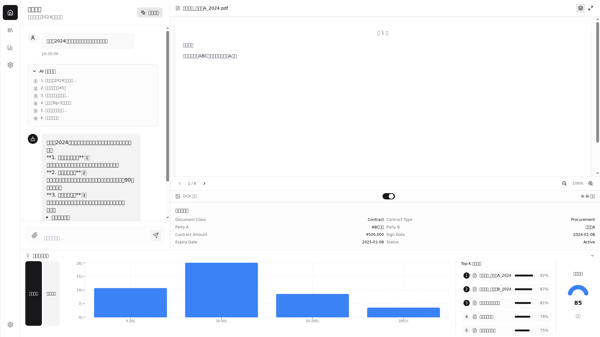

# RAG_fortend

RAG（检索增强生成）前端演示项目，基于 React + Vite 构建的企业级文档智能问答界面。

## 项目概述

RAG_fortend 是一个现代化的企业级 RAG（Retrieval-Augmented Generation）应用前端界面，提供智能文档检索、对话式问答和数据分析功能。该项目展示了如何构建一个专业的企业级 AI 问答系统。

## 技术栈

- **前端框架**: React 18 + Vite
- **样式**: Tailwind CSS
- **动画**: framer-motion
- **图标**: lucide-react
- **图表**: recharts
- **语言**: TypeScript-ready

## 功能特性

### 1. 智能对话界面
- 实时流式对话展示
- AI 思考路径可视化
- 消息反馈（👍👎）
- 引用跳转和关联文档展示
- 智能提示词补全

### 2. 文档检索与预览
- 语义相似度检索
- 文档内容高亮显示
- 文档元数据展示（合同编号、日期、金额等）
- AI 实体识别标签（甲方、乙方、金额、日期）
- 分页浏览

### 3. 历史记录管理
- 对话历史保存
- 历史记录搜索
- 时间线展示
- 一键清空历史

### 4. 数据分析面板
- 合同金额分布柱状图
- 文档类型分布饼图
- Top-K 检索结果展示
- 检索质量评分仪表盘
- 可折叠/展开面板

## 界面预览



## 部署说明

### 环境要求
- Node.js 16+
- npm 或 yarn

### 安装依赖
```bash
npm install
```

### 开发模式
```bash
npm run dev
```

### 构建生产版本
```bash
npm run build
```

### 预览生产构建
```bash
npm run preview
```

## 项目结构

```
RAG_fortend/
├── src/
│   ├── components/          # React 组件
│   │   ├── ChatArea.jsx     # 对话区域
│   │   ├── DocumentViewer.jsx  # 文档预览
│   │   ├── HistorySidebar.jsx  # 历史记录
│   │   ├── NavSidebar.jsx   # 导航栏
│   │   ├── InsightDock.jsx # 数据分析面板
│   │   └── ThinkingTrace.jsx  # 思考路径
│   ├── data/               # 模拟数据
│   ├── lib/               # 工具函数
│   ├── App.jsx            # 主应用
│   └── main.jsx           # 入口文件
├── public/                # 静态资源
├── dist/                  # 生产构建产物
└── package.json
```

## 在线预览

已部署至以下地址：
- http://43.173.126.25:37473
- http://43.173.126.25:35689

## 许可证

MIT
